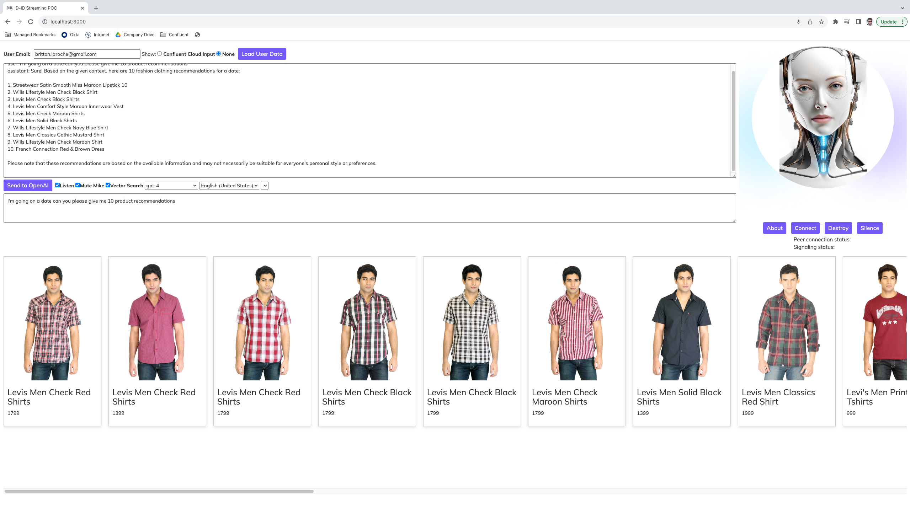

# Live Generative AI demo with Open AI - ChatGPT 4, Kafka, MongoDB Atlas Vector Search and D-ID

## Architecture:

## Initial Setup:
* (install express) open a terminal in the folder and run  - npm install express
* Add additional npm installs for what is missing in app.js
* run - npm i cors
* run - npm i express http-proxy-middleware
* run - npm i express morgan
* Pay attention to the rewrite rules in app.js and update for your MongoDB Atlas and Confluent Cloud Environments
* (add your api keys) edit the `api.json` inside the uncompressed folder and replace the emoji with your key
* When running the app.js at http://localhost:3000 press the "Open Settings" button and add in your D-ID and Open AI API keys.

## Start the demo:
* (bring up the app) in the folder (ctr left click on folder through finder) open the terminal run node app.js 
* You should see this message - server started on port localhost:3000
* (open the app) in the browser add localhost:3000
* (connect) press connect you should see the connection ready 
* (stream) press the start button to start streaming

## Franz Kafka Introduction Video
[![Franz Kafka introduction][()](https://www.youtube.com/watch?v=pLU7dS9DJJg)

## MongoDB Tutorials & Blogs
[Node Tutorial](https://www.mongodb.com/developer/products/atlas/semantic-search-mongodb-atlas-vector-search/)   
[Python Tutorial](https://www.mongodb.com/developer/products/atlas/building-generative-ai-applications-vector-search-open-source-models/)   
[MongoDB & Confluent Partner Blog](https://www.mongodb.com/blog/post/mongodb-atlas-vector-search-makes-real-time-ai-reality-confluent)  

## MongoDB Data Set
[Fashion Data Set](https://github.com/afsungur/mongodb-atlas-vector-search-fashion-products)

## Backend QNA Service
Github for back end QNA microservice that performs the Vector search in MongoDB Atlas and returns the results to the digital assistant app is here:   
[Backend QNA Service](https://github.com/ashwin-gangadhar-mdb/mdb-ecomm-recsys-chatapp/tree/main/backend)

## Video
[Youtube Application Demo](https://youtu.be/9thD4128lDE)

## App:

