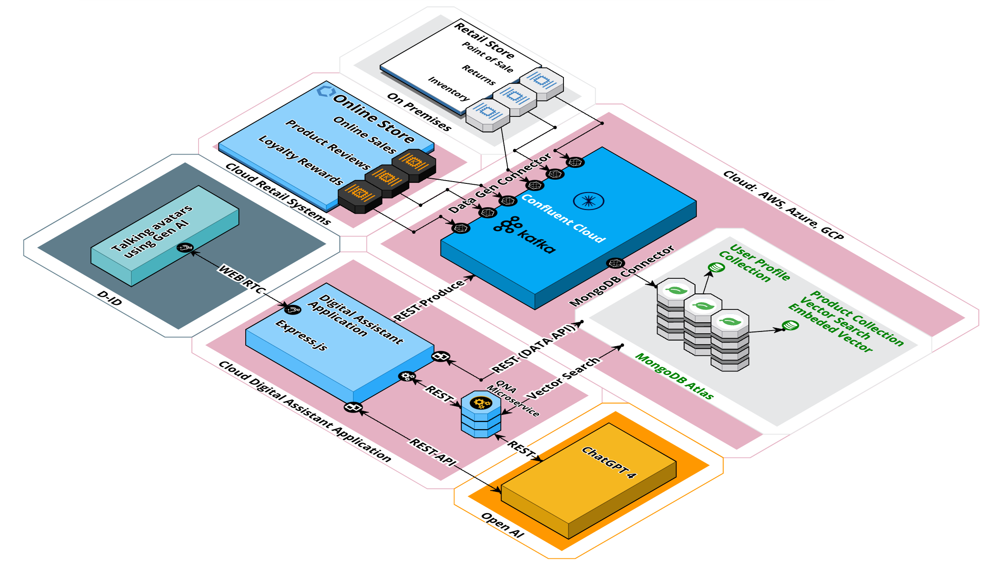

# Live Generative AI demo with Open AI - ChatGPT 4, Kafka, MongoDB Atlas Vector Search and D-ID

## Architecture:

## Initial Setup:
* (install express) open a terminal in the folder and run  - npm install express
* Add additional npm installs for what is missing in app.js
* run - npm i cors
* run - npm i express http-proxy-middleware
* run - npm i express morgan
* Pay attention to the rewrite rules in app.js and update for your MongoDB Atlas and Confluent Cloud Environments
* (add your api keys) edit the `api.json` inside the uncompressed folder and replace the emoji with your key

## Start the demo:
* (bring up the app) in the folder (ctr left click on folder through finder) open the terminal run node app.js 
* You should see this message - server started on port localhost:3000
* (open the app) in the browser add localhost:3000
* (connect) press connect you should see the connection ready 
* (stream) press the start button to start streaming

## App:

